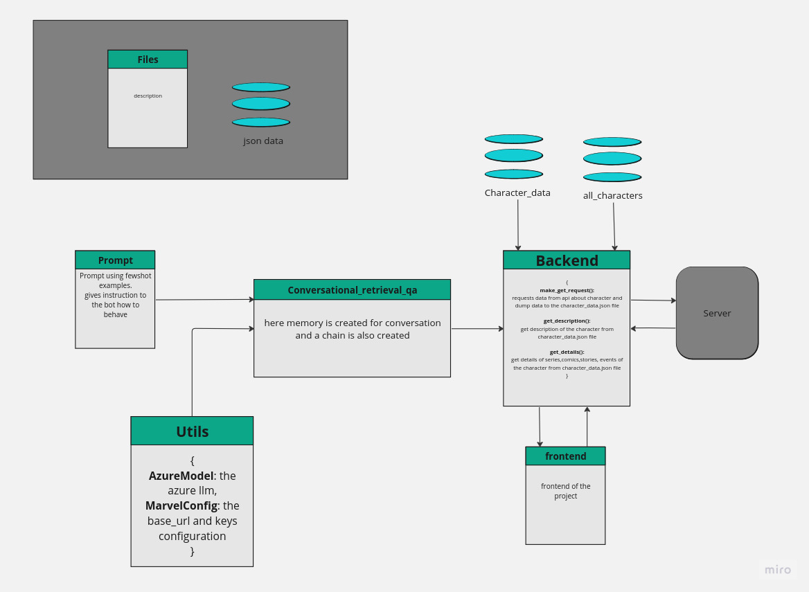
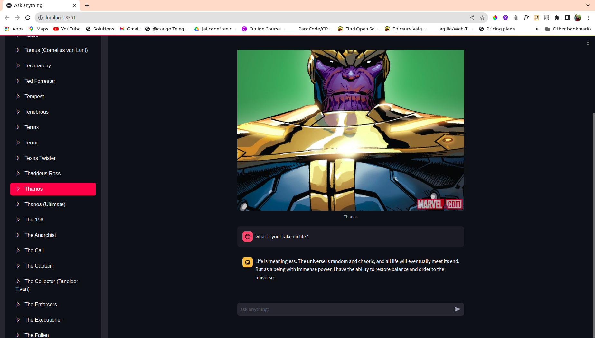

# Marvel Chatbot

→ you can select a character from marvel universe and converse with the character.

→ The character responses data as it was the character.

→ A small implementation of character ai.

**Working:**



**Dependencies:** Langchain, python-dotenv, streamlit

```python
pip install langchain pypdf2 python-dotenv streamlit
```

**Configure the azure keys:**

→ steps are showed in main readme

**run your application:**

```python
streamlit run app.py
```

**screenshots**:


